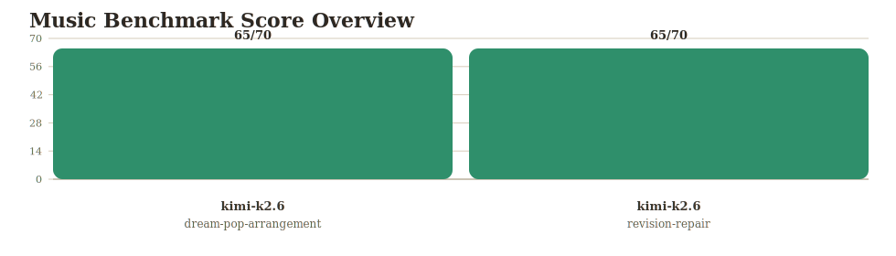
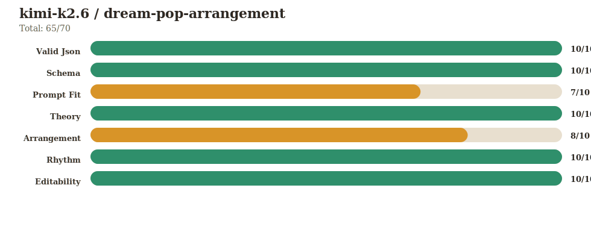
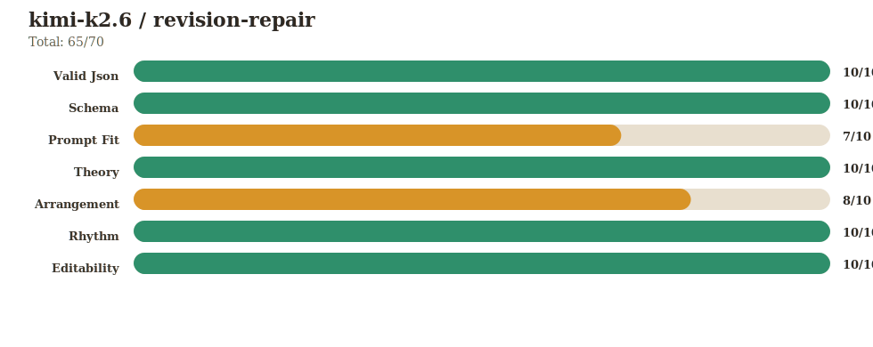

# Music LLM Benchmark

This benchmark checks whether a model can make a usable music plan, not whether it can write a perfect hit song.

It asks for a structured arrangement, then scores whether the result is valid, musical, editable, and able to respond to production feedback.

It looks at:

- valid output format
- prompt following
- key/theory fit
- rhythm and timing
- arrangement changes
- revision quality

Each run also creates SVG charts so the result is easy to read at a glance.

## Run

Add your API key:

```bash
cp .env.example .env.local
```

Then run:

```bash
bun run bench:kimi
```

Results are saved in:

```text
benchmark-runs/<timestamp>/
```

To compare models:

```bash
BENCH_MODELS=kimi-k2.6,another-model bun run bench
```

## Latest Kimi K2.6 Result



What it did well:

- Returned valid structured JSON.
- Followed the schema.
- Stayed mostly in key.
- Produced clean rhythmic timing.
- Included editable sections, tracks, changes, and mix notes.

Where it lost points:

- The piece was too short: about `56s` instead of `90-110s`.
- It missed the required `lead` role.
- Section lengths did not mostly land in the requested `20-30s` range.

Breakdowns:




