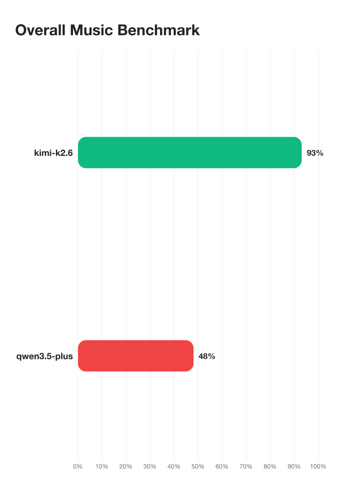
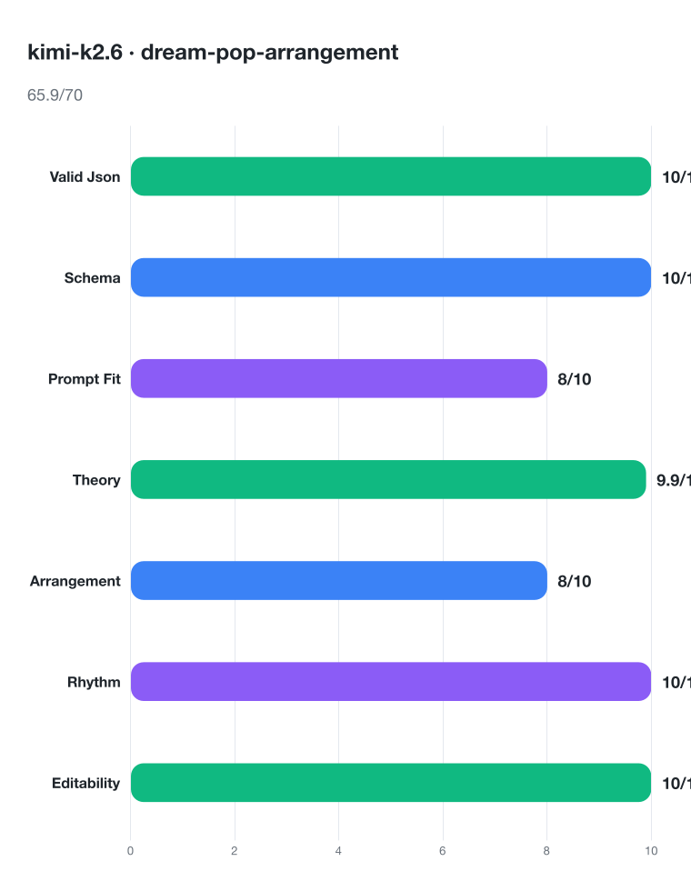
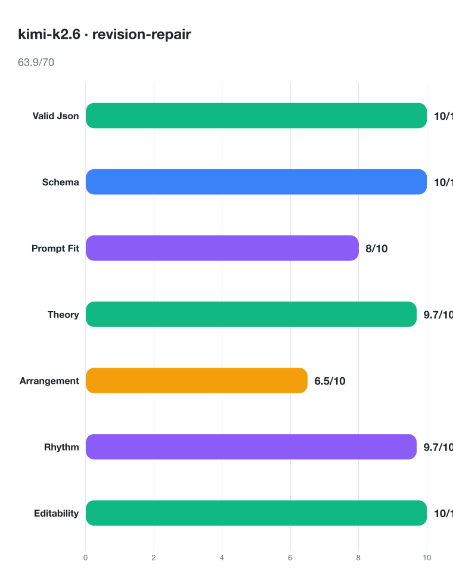
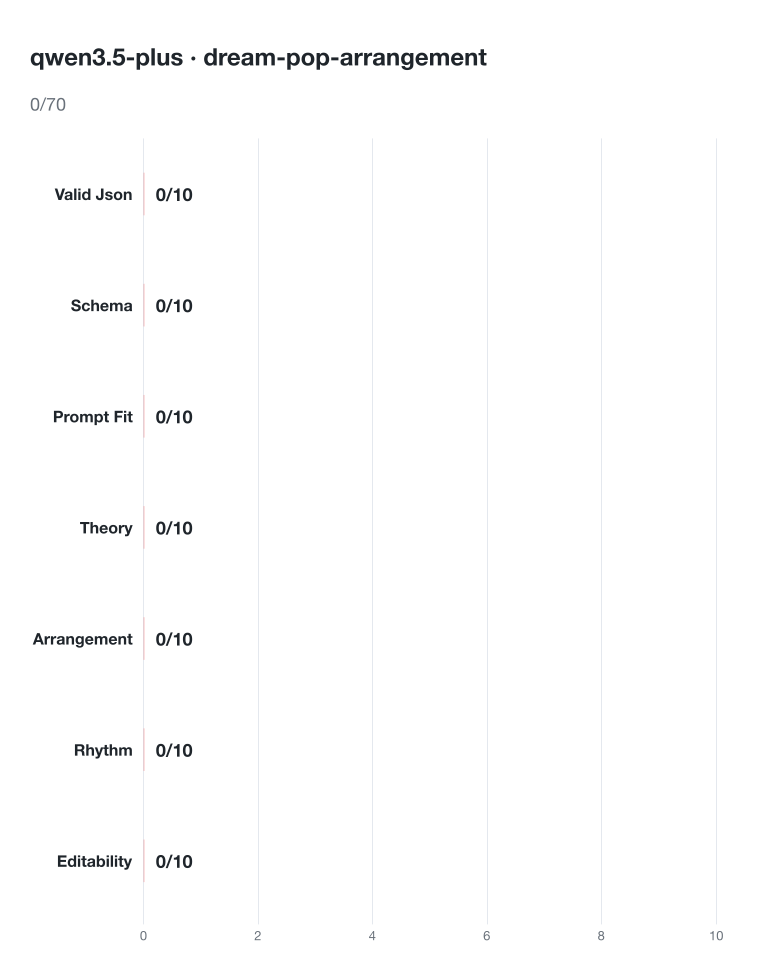
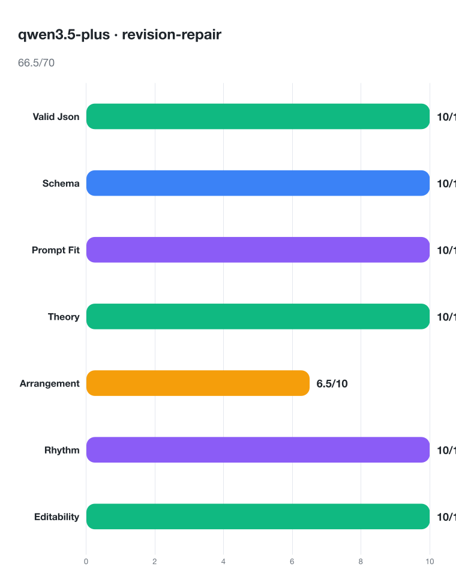

# Music LLM Benchmark

This checks whether a model can make a usable music plan, not whether it can write a perfect hit song.

It scores valid output, prompt following, music theory, rhythm, arrangement changes, and revision quality.

## Run

```bash
cp .env.example .env.local
bun run bench:kimi
```

Results are saved in `benchmark-runs/<timestamp>/`.

## Latest Result



Breakdowns:








